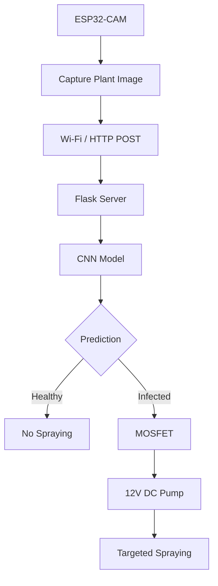

 # AgriGuard

## Intelligent Pesticide Spraying System:

AgriGuard is an AI Based plant disease detection and performs **targeted pesticide spraying mechanism** by automatically controlled a pesticide pump based on prediction.

---

### ⚙️Problem Statement

Traditional farming practices rely on **uniform pesticide spraying**, which leads to:

*  Excessive chemical usage.
*  Soil degradation & water pollution
*  Manual inspection which is time-consuming & inaccurate.
*  Spraying on healthy plants leads to unnecessary cost.

There is a need for an **automated, intelligent, and cost-effective system** that can detect plant infection and apply pesticides only where required.

---

### ⚙️Proposed Solution

AgriGuard uses **Embedded System Hardware and Computer Vision ** to create a smart spraying system that:

* Detects plant infection using a **CNN model**
* Classifies the disease (**Healthy / Infected**)
* Automatically sprays pesticide **if detected plant leaf  is infected**
* Avoids spraying on healthy plants.

---

### ⚙️Key Features

* ESP32-CAM Image Capture
* CNN Based image classification
* Targeted Pesticide Spraying
* Automatic Pump Control through MOSFET switching
* Eco-Friendly & Cost-Effective

---

### ⚙️System Architecture

---

### ⚙️Hardware Components

* ESP32-CAM : Image Capture + Processing Unit
* N-channel MOSFET (IRLZ44N) : Pump switching
* 12V Diaphragm Water Pump
* Nozzle : Spray mechanism
* Power Supply : 5V & 12V
* Connecting wires & circuit

---

### 💻 Software Stack

* Python : Numpy , Tensorflow and  OpenCV
* Flask (Backend Server)
* Convolution Neural Network CNN) Model

---

### ⚙️Working Flow

### Step 1: Image Capture
ESP32-CAM captures real-time image of plant leaves.

### Step 2: AI Analysis
Image is sent to Flask server through Wifi connection and  processed using CNN model.

### Step 3: Prediction Output
Model classifies plant image and predict:

* Healthy
* Infected

### Step 4: Decision Logic
* Healthy → No spray
* Infected → Spray

### Step 5: Action
ESP32 triggers MOSFET → pump ON → pesticide sprayed.

---

### ⚙️Results

*  Accurate disease detection
*  Reduced pesticide usage (~70%)

---

### 🎥 Demo

# Agriguard – Intelligent Pesticide Spraying System

[ Video link of Working Project ](https://drive.google.com/file/d/1iXNvRFo-fy9slbyxswfdRgqKMCK-vaEn/view?usp=sharing)

---

## ⚙️Innovation

Unlike traditional systems, AgriGuard introduces:

* **AI-driven infection-level based spraying**
* **Precision agriculture at low cost**
* **Hardware + AI integration in a single pipeline**

---

### ⚙️Impact

* Reduces environmental pollution
* Saves pesticide cost
* Improves crop yield
* Supports small-scale farmers

---

### ⚙️Future Scope

* Multi-disease classification
* Mobile app integration
* Cloud-based analytics dashboard

---

### ⚙️Authors

* Jaspreet
* Vartika Singh
* Divyanshi Katiyar
* Saksham Singhal

B.Tech – Electronics & Communication Engineering

---
